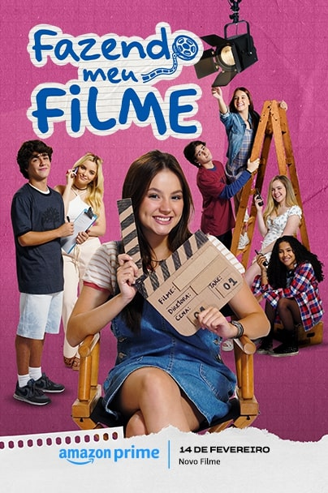
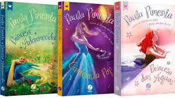

# portifolio-will

    
Eu sou a Paula Pimenta_

    <h1>Sou escritora </h1>
    
Sou a autora de Minha vida fora de serie e Fazendo o meu filme

    
Minhas habilidades

    

     <header class="container text-center">
    
    
Eu sou Paula Pimenta ♡ 📖

    <h1><small>Sou escritora</small></h1>
  
    
<em>Sou a autora de Minha vida fora de serie e Fazendo o meu filme.
      Sou formada em Publicidade pela PUC Minas, em música pela UEMG, trabalhei com marketing. 
    </em>
 <!-- em italico-->
   <!-- em negrito e subrinhado com marca texto-->
    
<mark><strong>Minhas habilidades</strong></mark>

    

        
Jornalismo

        
Professora de teatro e musica

        
Compositora

      

</header>
<main class="container mt-5">
  <h2 class=" text-center">Meus projetos</h2>
  

    <!-- projeto 1 -->
    

  

  
      

        <h5 class="card-title text-center text-dark ">Roteirista colaboradora </h5>
        

<em>Neste projeto há os filmes em que atuei como roteirista.</em>

      

      

        <button type="button"class="btn btn-light"data-bs-target="#modal1"data-bs-toggle="modal">Ver filmes:</button>
      

    

  

<!-- projeto 2 -->
  

  

      
      

        <h5 class="card-title text-center text-dark">Coleções escritas </h5>
        
        
<em>Neste projeto você verá as coleções que escrevi.</em>

      

      

      <button type="button"class="btn btn-light"data-bs-target="#modal2"data-bs-toggle="modal">Ver Coleções:</button>
    

  

  <!-- projeto 3 -->
  
 <!--tirei o menos 4 -->
    

        
        

          <h5 class="card-title text-center text-dark">Meus livros </h5>
          
         
<em>Neste projeto você verá os livros que escrevi.</em>

        

        

          <button type="button"class="btn btn-light"data-bs-target="#modal3"data-bs-toggle="modal">Ver Livros:</button>
      

    

   <!-- modal 1 -->

  

    

      

        <h5 class="modal-title">Filmes</h5>
        
        <button
          type="button"
          class="btn-close"
          data-bs-dismiss="modal"
          aria-label="Close"
        ></button>
      

      

        
<small class="text-primary"><strong> Já assistiu esses filmes? Se já assistiu, deixa o seu check-in.</small></strong>

        
<input class="form-check-input" type="checkbox" value="" id="checkDefault">
          <label class="form-check-label" for="checkDefault">
            
<em> 2019 Cinderela Pop </em>

            
           </label>
 
           
<input class="form-check-input" type="checkbox" value="" id="checkDefault">
            <label class="form-check-label" for="checkDefault">
              
<em>2023 Um Ano Inesquecível - Inverno</em>

              </label>
 
            
<input class="form-check-input" type="checkbox" value="" id="checkDefault">
              <label class="form-check-label" for="checkDefault">
                
<em>2024 Fazendo Meu Filme </em>

                 
 </label>

                
<input class="form-check-input" type="checkbox" value="" id="checkDefault">
                  <label class="form-check-label" for="checkDefault">
                     
<em>2024 Princesa Adormecida</em>

                  </label>
 

                  

                    <button class="btn btn-primary" data-bs-target="#exampleModalToggle2" data-bs-toggle="modal">Salvar alterações</button>
                  

                
    

<!-- modal 2-->

  

    

      

        <h5 class="modal-title">Coleções</h5>
        <button
          type="button" class="btn-close"data-bs-dismiss="modal" aria-label="Close"></button>
      

      

        
 Minhas coleções de livros são feitas de palavras que abraçam, histórias que tocam a alma e caminhos que levam o leitor a outros mundos. Em cada página, há um pouco de mim e muito do que a vida ensina.

        
<mark><strong>Fazendo meu filme</strong></mark>
          
          
 <!--check-in-->
         <input class="form-check-input" type="checkbox" value="" id="checkDefault">
         <label class="form-check-label" for="checkDefault">
          
<em>2008 Fazendo meu Filme : A Estreia de Fani</em>

        </label> 

         
<input class="form-check-input" type="checkbox" value="" id="checkDefault">
  <label class="form-check-label" for="checkDefault">
 
<em>2009 Fazendo meu Filme 2 : Fani na Terra da Rainha</em>
</label> 

  
<input class="form-check-input" type="checkbox" value="" id="checkDefault"><label class="form-check-label" for="checkDefault">
<em>2010 Fazendo meu Filme 3 : O Roteiro Inesperado de Fani</em>
</label>
 
  
<mark><strong>Minha vida fora de série</strong></mark> 

 
 <input class="form-check-input" type="checkbox" value="" id="checkDefault"> <label class="form-check-label" for="checkDefault"> 
<em>2011 Minha Vida Fora de Série : 1ª temporada</em>
 </label> 
 
<input class="form-check-input" type="checkbox" value="" id="checkDefault"><label class="form-check-label" for="checkDefault">
<em>2013 Minha Vida Fora de Série : 2ª temporada</em>
</label>

 
<input class="form-check-input" type="checkbox" value="" id="checkDefault"><label class="form-check-label" for="checkDefault">
 
<em>2015 Minha Vida Fora de Série : 3ª temporada</em>
</label>

  
<mark><strong>Princesas</strong></mark> 
  

 <input class="form-check-input" type="checkbox" value="" id="checkDefault">
  <label class="form-check-label" for="checkDefault">
   
<em>2014 Princesa Adormecida </em>
</label>

   
<input class="form-check-input" type="checkbox" value="" id="checkDefault"><label class="form-check-label" for="checkDefault"> 
<em>2015 Cinderela Pop </em>
 </label>

<input class="form-check-input" type="checkbox" value="" id="checkDefault"> <label class="form-check-label" for="checkDefault">
  
<em>2016 Princesa das Águas</em>
</label>

  <button class="btn btn-primary" data-bs-target="#exampleModalToggle2" data-bs-toggle="modal">Salvar alterações</button>

              

      
  

<!--modal 3 -->

  

    

      

        <h5 class="modal-title">Livros</h5>
        <button type="button" class="btn-close" data-bs-dismiss="modal" aria-label="Close"></button>
      

      

Te convido a conhecer meus livros. Cada página guarda uma nova emoção, esperando por você.Vamos embarcar juntos nessa leitura?

         
  
<input class="form-check-input" type="checkbox" value="" id="checkDefault">
            
<em>Apaixonada por Palavras</em>

 </label>

  
<input class="form-check-input" type="checkbox" value="" id="checkDefault">
 <label class="form-check-label" for="checkDefault">

<em>O Livro das Princesas</em>

 </label>

        
<input class="form-check-input" type="checkbox" value="" id="checkDefault">
   <label class="form-check-label" for="checkDefault">
   
<em>Confissão</em>

</label>

 
<input class="form-check-input" type="checkbox" value="" id="checkDefault">
 <label class="form-check-label" for="checkDefault">
   
<em>Apaixonada por você</em>

  </label>

   

  <button class="btn btn-primary" data-bs-target="modal3" data-bs-toggle="modal">Salvar alterações</button>
   

      
  

<!-- citação -->
<figure class="text-center">
  <blockquote class="blockquote">
    
<em><small>Eu já tinha acreditado que algum dia eu seria como a protagonista de um da queles filmes,
       que o final feliz seria questão de tempo...Mais descobri que a felicidade e finais não combinam.</em></small>

  </blockquote>
  <figcaption class="blockquote-footer text-danger">
     <cite title="Source Title">Fazendo o meu filme</cite>
  </figcaption>
</figure>
<!-- rodapé -->
<footer class="container  py-5">
  <h2 class="text-primary">Entre em contato</h2> <!-- PINTEI DE AZUL -->
  

    <i class="bi bi-github"><a href="https://github.com/Wiltania">Github</a></i><!--coloquei em formato de lista -->
  

  

    <i class="bi bi-envelope-at"></i><A:mail> wiltania.pierre-louis@escola.pr.gov.br</A:mail><!--coloquei em formato de lista -->
  

  
Desenvolvido com carinho por Wiltania Pierre-Louis. 2025

  </footer>
</body>
</html>
